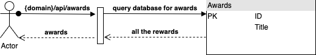
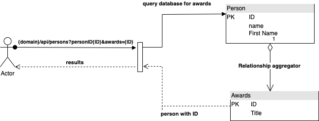
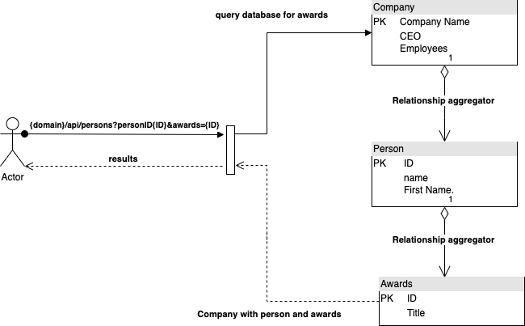
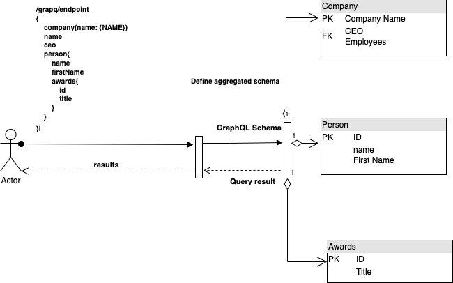

# AEM Content Fragments with GraphQL – Getting started with GraphQL
## Introduction:
### What is GraphQL?

GraphQL is a query language for APIs and provides a complete and understandable description of the data in your API.

### For example:
Let’s consider an external system with following tables:

1 to 1 relationship between Company table with person table and 1 to 1 person table with awards table.

If I need get all awards
You might be doing a call to 
### {domain}/api/awards

To get individual person and awards
### {domain}/api/persons?personID{ID}&awards={ID}

To get individual company and person and awards
### {domain}/api/company?companyNam={NAME}personID={ID}&awards={ID}

But in GraphQL you can send the parameters like a query and get all the related content as well

To use Graph QL you need to prepare schemas and based on schema you can do filter the data.

For more information on GraphQL you can visiting the link

Benefits:
•	Avoiding iterative API requests as with REST,
•	Ensuring that delivery is limited to the specific requirements,
•	Allowing for bulk delivery of exactly what is needed for rendering as the response to a single API query.

To Learn More click here: 

